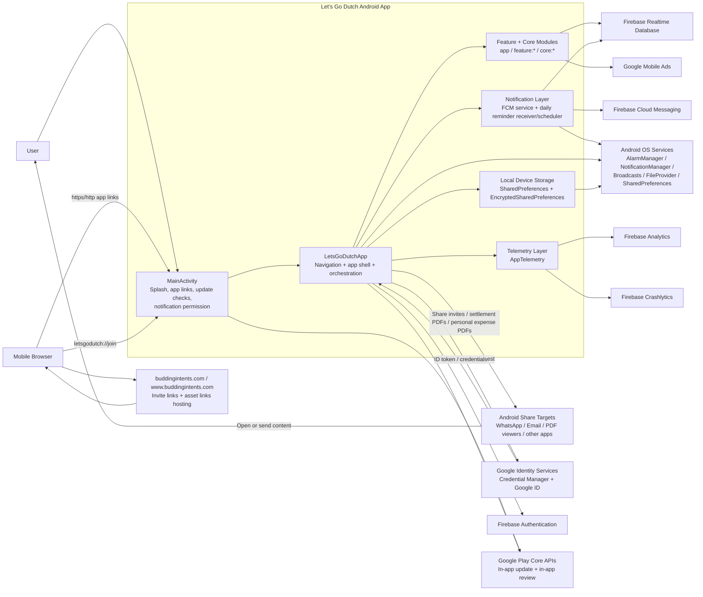

# Let's Go Dutch Application Architecture

Last updated: `2026-04-10`

This document captures the current application architecture as implemented in the repo, including the external entities the app integrates with.

## 1. System Context Diagram

## 2. Internal Module And Integration Diagram

```mermaid
flowchart TB
    subgraph appModule["app module"]
        application["LetsGoDutchApplication\nFirebase init, telemetry init,\nMobile Ads init, RTDB persistence,\ndaily reminder scheduling"]
        activity["MainActivity\nApp links, theme, Play update flow,\nnotification permission"]
        shell["LetsGoDutchApp\nNavigation + repository bundle + review flow"]
        notificationLayer["notifications/*\nFCM service, token sync,\ndaily reminder scheduler/receiver"]
        appOwned["App-owned screens\nSettings / personal tracker / todo / app tour"]
    end

    subgraph featureModules["feature modules"]
        authFeature["feature:auth"]
        groupsFeature["feature:groups"]
        expensesFeature["feature:expenses"]
        ledgerFeature["feature:ledger"]
        insightsFeature["feature:insights"]
        settlementFeature["feature:settlement"]
    end

    subgraph coreModules["core modules"]
        commonCore["core:common\nDispatchers + shared helpers"]
        modelCore["core:model\nGroup / Expense / Balance /\nUserProfile / Money / settlement models"]
        designCore["core:designsystem\nTheme + components + tokens"]
        dataCore["core:data\nRepository interfaces + Firebase repos +\nin-memory fallback repos + split engine"]
    end

    subgraph runtimeData["Repository bundle created at runtime"]
        repoBundle["RepositoryBundle"]
        firebaseRepos["Firebase repositories\nAuth / Group / Expense / Settlement /\nTodo / PersonalExpense"]
        fallbackRepos["In-memory repositories\nDemo / offline fallback if Firebase init fails"]
    end

    subgraph external["External integrations"]
        credMgr["Credential Manager + Google ID"]
        authSvc["Firebase Auth"]
        rtdb["Firebase Realtime Database"]
        fcm["Firebase Cloud Messaging"]
        analytics["Firebase Analytics"]
        crashlytics["Firebase Crashlytics"]
        ads["Google Mobile Ads"]
        updates["Google Play In-App Updates"]
        reviews["Google Play In-App Review"]
        browserHost["buddingintents.com app links"]
        os["Android OS services\nAlarmManager / NotificationManager /\nBroadcasts / FileProvider / prefs"]
        shareSheet["Android sharesheet + external apps"]
    end

    application --> notificationLayer
    application --> analytics
    application --> crashlytics
    application --> fcm
    application --> ads
    application --> rtdb

    activity --> shell
    activity --> updates
    activity --> browserHost
    activity --> os

    shell --> appOwned
    shell --> authFeature
    shell --> groupsFeature
    shell --> expensesFeature
    shell --> ledgerFeature
    shell --> insightsFeature
    shell --> settlementFeature
    shell --> reviews
    shell --> repoBundle
    shell --> shareSheet
    shell --> notificationLayer

    authFeature --> designCore
    groupsFeature --> designCore
    expensesFeature --> designCore
    ledgerFeature --> designCore
    insightsFeature --> designCore
    settlementFeature --> designCore
    appOwned --> designCore

    authFeature --> modelCore
    groupsFeature --> modelCore
    expensesFeature --> modelCore
    ledgerFeature --> modelCore
    insightsFeature --> modelCore
    settlementFeature --> modelCore
    appOwned --> modelCore

    authFeature --> dataCore
    groupsFeature --> dataCore
    expensesFeature --> dataCore
    ledgerFeature --> dataCore
    insightsFeature --> dataCore
    settlementFeature --> dataCore
    appOwned --> dataCore

    dataCore --> commonCore
    dataCore --> modelCore
    dataCore --> firebaseRepos
    dataCore --> fallbackRepos
    repoBundle --> firebaseRepos
    repoBundle --> fallbackRepos

    firebaseRepos --> credMgr
    firebaseRepos --> authSvc
    firebaseRepos --> rtdb
    notificationLayer --> fcm
    notificationLayer --> rtdb
    notificationLayer --> authSvc
    notificationLayer --> os

    shell --> analytics
    shell --> crashlytics
    groupsFeature --> ads
    ledgerFeature --> ads
    insightsFeature --> ads
    shell --> os
    shell --> shareSheet
```

## 3. External Entities Covered

| External entity | How LGD integrates |
|---|---|
| `Firebase Authentication` | Google sign-in and anonymous sign-in, account upgrade/link flows |
| `Firebase Realtime Database` | Primary backend store for users, groups, members, expenses, balances, notifications, FCM tokens, todo tasks, personal expenses, and settlement-dispatch state |
| `Firebase Cloud Messaging` | Push-token registration, FCM message reception, local notification display |
| `Firebase Analytics` | Event logging and user-property tracking |
| `Firebase Crashlytics` | Crash and non-fatal telemetry with user and operation tags |
| `Credential Manager + Google ID` | Google credential retrieval and ID token acquisition |
| `Google Play Services Auth` | Supporting Google-auth integration path |
| `Google Mobile Ads` | Banner and interstitial ad rendering in app surfaces |
| `Google Play In-App Updates` | Flexible update checks and install flow in `MainActivity` |
| `Google Play In-App Review` | Native review prompt flow from the app shell |
| `buddingintents.com` and `www.buddingintents.com` | Verified Android App Links for invite joins |
| `Android Browser` | Entry point for verified links and custom-scheme invite flows |
| `Android OS notification stack` | Notification channels, grouped notifications, notification permission gating |
| `Android AlarmManager + broadcasts` | Daily unsettled-group reminders and rescheduling on boot, package replace, time, and timezone changes |
| `FileProvider + Android sharesheet` | Sharing invites, settlement PDFs, and personal-expense PDFs to external apps |
| `SharedPreferences / EncryptedSharedPreferences` | Theme, tour, review-prompt, local experience, and anonymous-session state |

## 4. Runtime Notes

- The app composes a `RepositoryBundle` at runtime in `LetsGoDutchApp.kt`.
- Default runtime path is Firebase-backed repositories.
- If repository initialization fails, the app falls back to in-memory repositories for demo-mode behavior.
- `LetsGoDutchApplication` enables Firebase Realtime Database offline persistence, so the runtime path is Firebase-backed with offline support rather than a separate local database.
- Notification behavior mixes two paths:
  - push path via FCM service
  - local scheduled reminder path via `AlarmManager` and the reminder receiver

## 5. Primary Source Files

- `app/src/main/java/com/buddingintents/letsgodutch/LetsGoDutchApplication.kt`
- `app/src/main/java/com/buddingintents/letsgodutch/MainActivity.kt`
- `app/src/main/java/com/buddingintents/letsgodutch/LetsGoDutchApp.kt`
- `app/src/main/java/com/buddingintents/letsgodutch/notifications/`
- `core/data/src/main/java/com/buddingintents/letsgodutch/core/data/repository/`
- `app/src/main/AndroidManifest.xml`
- `README.md`
